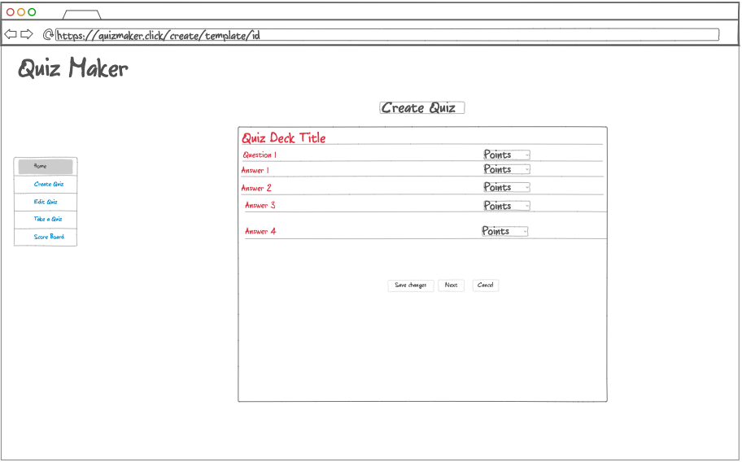
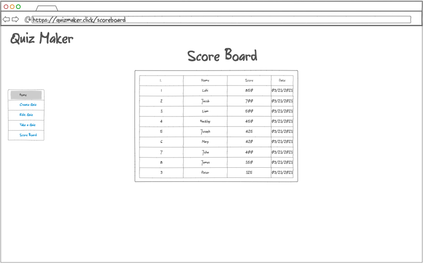
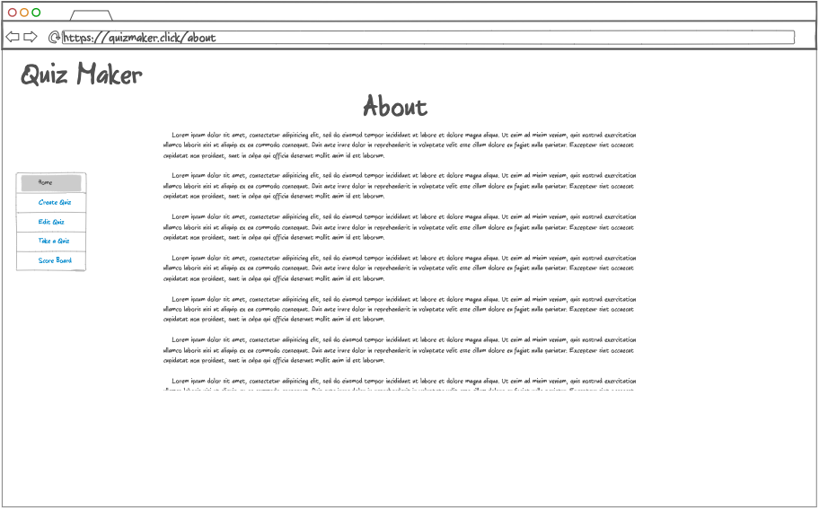

# Quiz Maker
## Description Deliverable

### Elevator Pitch

Have you ever been stressed out for a test and there is too much to learn for the test? Start small quizzing yourself on the subject matter one question at a time, once you create a quiz deck and get all the questions right, you will feel relieved that you got the correct knowledge to ace that test.

Quiz Maker is a fun application that lets you build an online quiz platform where users can create quizzes, take quizzes, and view their scores. Each user will have their own account behind authentication. All the quizzes and answers will be stored in a database, so go ahead and start today creating and taking quizzes, the result of each quiz will  update your scores real-time.

### Designs

#### Login
<!--  -->

#### Dashboard
<!--  -->

#### Create
<!--  -->

#### Edit
<!--  -->

#### Scoreboard
<!--  -->

#### About
<!--  -->

### Key Features

* Secure login over HTTPS
* Ability to create quizzes
* Ability to edit quizzes
* Ability to take any quizzes created in the system
* Ability as a creator of a quiz to give points to a given question
* Quizzes are persistently stored
* A scoreboard will list all scores real-time

### Technologies

I will be using the below technologies in the following ways:

* HTML: A few web pages to display & create quizzes, navigation links from one page to another
* CSS: Style web pages and make it more user friendly, good spacing between elements, readability, and mobile friendly.
* Javascript: logic to enable user to perform actions on each web page. 
* Service: Backend API rest service:
  * login
  * get/add/edit/delete quizzes
  * get/add/edit/delete questions points if creator of the quiz
  * submit quiz score
  * get scoreboard data
  * get dashboard data
  * get about data
* DB: store user scores in long term storage
* Login: Register & login users. Secure secrets in database / use 3rd party tools. User can only interact with website after successful login.
* WebSocket: User's activities and scores will be updated real-time coming from server w/out client asking for it
* React: Application will be then ported to React framework.

## HTML deliverable

For this deliverable I built out the structure of my application using HTML.

- **HTML pages** - A few HTML pages that represent the ability to login create/edit/take a quiz.
- **Links** - The login page automatically links to the quiz dashboard page.
- **Text** - Each page contains dummy data to create/edit/take a quiz, represented by a textual description.
- **3rd party service calls** - Located on the about page, it will be a dynamic motivational quote.
- **Images** - Added an image for both About page as well as for the facicon.ico.
- **Login** - Input box and submit button for Sign In and Sign Out and displays username.
- **Database** - The scores page represent data pulled from the database.
- **WebSocket** - While taking a quiz, a display of user activities/scores taking quizzes represent the users activity realtime.

## CSS deliverable

For this deliverable I properly styled the application into its final appearance.

- **Header, footer, and main content body** - Styled all sections, created a few stylesheets to accomplish that.
- **Navigation elements** - Created pages edit/take/create all accessible from Home page. Modified the theme colors as well as coded dark/light theme. Used bootstrap to get many styles and my own as well.
- **Responsive to window resizing** - The application looks great on both desktop and mobile devices.
- **Application elements** - Used good contrast and whitespace.
- **Application text content** - Consistent font (sans-serif).
- **Application images** - Styled an image for the About page.

## JavaScript deliverable

For this deliverable I implemented with JavaScript so that the application works for a single user or multiple as long as they use same machine and signout. I also added placeholders for future technology.

- **login** - Register the user with a username and password these will for the time being be stored in local storage until we can keep secrets safe somewhere else in a next iteration. The login/register button takes you to the dashboard.

- **database** - The scoreboard displays dyamically the total scores from each user that uses the app on the same machine. Currently this is all stored and retrieved from local storage, but it will be replaced with the database data later.
  
- **WebSocket** - I used the setInterval function to periodically insert players new scores, this is viweable while taking a quiz. This will be replaced with WebSocket messages later.
  
- **application** logic - In the Dashboard you can create/edit/take/delete quizzes. Users will be able to see their own created quiz list as well as if another user signs in after you signout (by clicking to Quiz Maker logo navigation top left) that user will see community quizzes created by the other user and is able to take the quiz, but not rights to edit/delete, that is only available if you created the original quiz. A lot of work has been done in the creation, editability, taking of a quiz, quiz lists, users creation and saving data in local storage.

## Startup Service deliverable

This deliverable demonstrates converting the JavaScript application into a web application by implementing a web service that listens on a network port for HTTP requests.

For this deliverable I added backend endpoints that get/post/put/delete a quiz, get/post for scores, gets/post for users for the time being it is all saing in memory on the server.

- **Node.js/Express HTTP service** - done!
- **Static middleware for frontend** - done!
- **Calls to third party endpoints** - done!
- **Backend service endpoints** - Placeholders for login that stores the current user on the server. Endpoints get/post/put/delete a quiz, get/post for scores, gets/post for users.
- **Frontend calls service endpoints** - I did this using several fetch function calls to interact with API.

## DB deliverable
For this deliverable I stored the scores/users/quizzes in the database.

- **MongoDB Atlas database created** - done!
- **Endpoints for data** - Endpoints now process the data and send it to Mongo.
- **Stores data in MongoDB** - done!

## Login deliverable
For this deliverable I associate the votes with the logged in user.

- **User registration** - Creates a new account in the database.
- **Existing user** - take/create/edit Quizzes under the same user if the user already exists.
- **Use MongoDB to store credentials** - Stores both user and quizzes created by user or community.
- **Restricts functionality** - You cannot create/edit/take quizzes until you have signed in. This is enforced on both the frontend as well as the backend API.

## WebSocket deliverable

For this deliverable I used webSocket to get updates from other users taking a quiz and submitting scores on the frontend in realtime.

- **Backend listens for WebSocket connection** - done!
- **Frontend makes WebSocket connection** - done!
- **Data sent over WebSocket connection** - done!
- **WebSocket data displayed** - All users taking a quiz or submitting a score after taking the quiz get messages about it on the screen in realtime. Also on connected/disconnected to websockets emit events that ends up on screen accordingly. I have also added a button on about page after initial quote load on each browser you can then click on button "Get new Quote" and the new quote will synchronize amongst the browsers using websocket.

## React deliverable

For this deliverable I converted the application over to use React.

- **Bundled and transpiled** - done!
- **Components** - Login, About, Create, Dashboard, Edit, Quiz, Scores are all components.
- **Router** - Routing between Login, About, Create, Dashboard, Edit, Quiz and Scores components, additional routing for a not found routing is also deployed.
- **Hooks** - Used UseState to track changes in quiz app state in all components.

[Notes link](notes.md)

